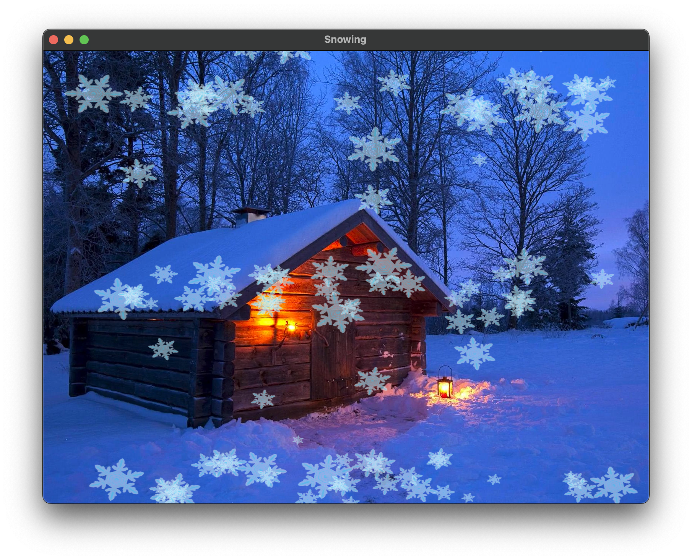

# Snow Animation Program

This is an OpenGL-based snowflake falling animation program that displays the effect of snowflakes falling with the wind against a night sky background.

[中文文档](README_zh.md)

[Report](report.md)



## Project Features

- Developed with modern OpenGL (GLEW/GLFW)
- Realistic snowflake falling physics
- Randomly generated snowflake size, rotation, and falling trajectories
- Transparency blending for realistic snowflake effects
- Gradually increasing number of snowflakes, up to 100
- Simulated wind effects for more natural snowflake movement

## Requirements

- C++17 compiler
- CMake 3.10+
- OpenGL
- GLEW library
- GLFW3 library
- Supported platforms: Windows, macOS, Linux

## Build Steps

1. Clone or download this project code

2. Create and enter the build directory:
   ```bash
   mkdir build && cd build
   ```

3. Configure the project with CMake:
   ```bash
   cmake ..
   ```

4. Compile the project:
   ```bash
   make
   ```

## Running the Program

After compilation, run the generated executable:

```bash
./snowing
```

## Usage Instructions

- After the program starts, the window will display a snowfall animation
- The number of snowflakes will gradually increase from 30 to 100
- You can exit the program by:
  - Pressing the ESC key
  - Clicking the close button in the top-right corner of the window

## File Structure

- `src/main.cpp` - Main program code
- `include/stb_image.h` - Image loading library
- `textures/` - Background and snowflake images
  - `background.png` - Night sky background image
  - `snow.png` - Snowflake image
- `shaders/` - Shader files directory
  - For OpenGL rendering vertex and fragment shaders

## Implementation Details

The program uses GLFW to create a window and manage the OpenGL context, and GLEW to load OpenGL extensions. The physics simulation of snowflakes includes gravity, wind force, and air resistance. Each snowflake has a unique combination of parameters, ensuring diversity and naturalness of the falling effect.

The transparency of snowflakes is dynamically calculated by analyzing pixel brightness, allowing snowflake edges to blend smoothly into the background, enhancing the realism of the visual effect. 