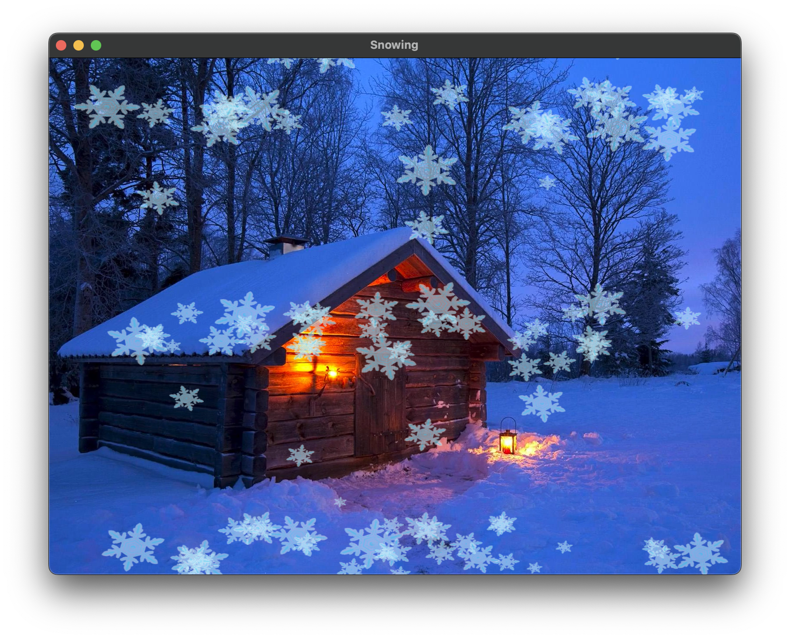

# 飘雪动画程序

这是一个基于OpenGL的雪花飘落动画程序，展示了雪花在夜空背景下随风飘落的效果。

[English Document](README.md)

[报告](report_zh.md)



## 项目特点

- 基于现代OpenGL (GLEW/GLFW)开发
- 真实的雪花飘落物理效果
- 随机生成的雪花大小、旋转和飘落轨迹
- 透明度混合实现逼真的雪花效果
- 雪花数量逐渐增加，最高可达100个
- 模拟风力效果，使雪花飘落更加自然

## 环境要求

- C++17编译器
- CMake 3.10+
- OpenGL
- GLEW库
- GLFW3库
- 支持的平台：Windows、macOS、Linux

## 构建步骤

1. 克隆或下载本项目代码

2. 创建构建目录并进入：
   ```bash
   mkdir build && cd build
   ```

3. 使用CMake配置项目：
   ```bash
   cmake ..
   ```

4. 编译项目：
   ```bash
   make
   ```

## 运行程序

编译完成后，直接运行生成的可执行文件：

```bash
./snowing
```

## 操作说明

- 程序启动后，窗口中会展示雪花飘落的动画效果
- 雪花数量会从30个逐渐增加到100个
- 可以通过以下方式退出程序：
  - 按下键盘上的ESC键
  - 点击窗口右上角的关闭按钮

## 文件结构

- `src/main.cpp` - 主程序代码
- `include/stb_image.h` - 图像加载库
- `textures/` - 存放背景和雪花图像
  - `background.png` - 夜空背景图像
  - `snow.png` - 雪花图像
- `shaders/` - 着色器文件目录
  - 用于OpenGL渲染的顶点和片段着色器

## 实现细节

程序使用GLFW创建窗口并管理OpenGL上下文，使用GLEW加载OpenGL扩展。雪花的物理模拟包括重力、风力和空气阻力，每个雪花都有独特的参数组合，确保飘落效果的多样性和自然感。

雪花的透明度通过分析像素亮度动态计算，使雪花边缘能够平滑混合到背景中，提高视觉效果的真实感。 